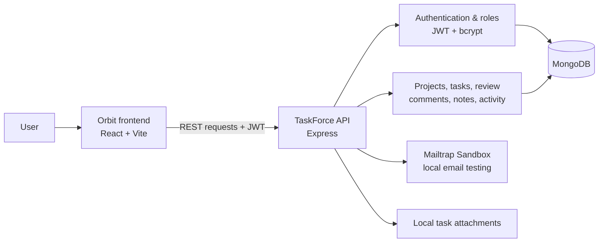
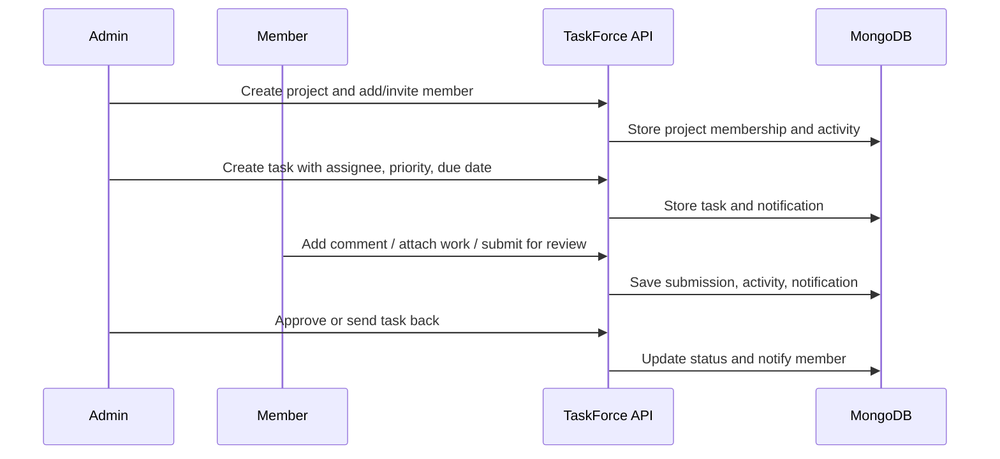

# TaskForce

TaskForce is a role-based project collaboration application built as a final-year placement project. Its Express REST API supports secure authentication, project membership, task planning, reviewable work submissions, deadlines, and team communication. The React frontend is branded as **Orbit**.

## Why this project is useful

Most task-management demos stop at creating and updating tasks. TaskForce models the practical team workflow around them: a project owner creates work, a member completes it, attaches evidence, submits it for review, and a manager approves it or sends it back. Activity history and notifications keep that workflow visible.

## Key features

- JWT authentication with email verification, password reset, refresh tokens, and password change.
- Clear project-level roles: **Admin**, **Project Admin**, and **Member**.
- Projects, task assignment, priority, difficulty, due dates, deadlines, subtasks, comments, notes, attachments, and activity history.
- A simple review workflow: assigned members submit work; Admins and Project Admins approve or return it.
- Existing-user membership and secure invitation flow for people who have not registered yet.
- Personal deadline list and calendar views for assigned tasks.
- Input validation, JSON error responses, permission checks, security headers, CORS configuration, and automated API tests.

## Architecture



**Important design decision:** the frontend may hide controls based on role, but the Express API is the final permission check. Changing browser code cannot grant a Member manager access.

## Requirements

- Node.js 20 or later
- MongoDB (Atlas or local)
- SMTP credentials for verification and password-reset emails (Mailtrap is suitable for local development)

## Run locally

```bash
npm ci
# Create a local .env file with the variables shown below.
npm run dev
```

The server starts on `http://localhost:3000` unless `PORT` is changed. Check it with `GET /api/v1/healthcheck`.

### Run the Orbit frontend

In a second terminal, start the React frontend from the same repository:

```bash
cd frontend
npm ci
npm run dev
```

Create `frontend/.env` locally with the public API address:

```env
VITE_API_BASE_URL=http://localhost:3000/api/v1
```

Open `http://localhost:5173`. The root `.gitignore` keeps this local `.env` file out of Git.

## Configuration

Create a local `.env` file and set the following values. Never commit `.env`. The example values below are intentionally non-secret.

| Variable | Purpose |
| --- | --- |
| `PORT` | HTTP port, for example `3000` |
| `MONGO_URI` | MongoDB connection URI |
| `ACCESS_TOKEN_SECRET` | Long random secret for access tokens |
| `ACCESS_TOKEN_EXPIRY` | Access token lifetime, for example `1d` |
| `REFRESH_TOKEN_SECRET` | Different long random secret for refresh tokens |
| `REFRESH_TOKEN_EXPIRY` | Refresh token lifetime, for example `10d` |
| `CORS_ORIGIN` | Allowed frontend origin, for example `http://localhost:5173` |
| `FORGOT_PASSWORD_REDIRECT_URL` | Frontend reset-password URL |
| `PROJECT_INVITE_REDIRECT_URL` | Frontend registration page used in project-invitation emails |
| `MAILTRAP_SMTP_HOST` | SMTP host |
| `MAILTRAP_SMTP_PORT` | SMTP port |
| `MAILTRAP_SMTP_USER` | SMTP username |
| `MAILTRAP_SMTP_PASS` | SMTP password |
| `TEST_MONGO_URI` | A separate database used only by `npm test` |

Use different database names for `MONGO_URI` and `TEST_MONGO_URI`. This prevents automated test data from ever touching real development data.

## Application flow



## Authentication

Most endpoints require a JWT access token. After `POST /api/v1/auth/login`, take `data.accessToken` from the response and include it in requests:

```http
Authorization: Bearer <access-token>
```

The login response also includes a refresh token. Use it with `POST /api/v1/auth/refresh-token` when the access token expires.

Project roles are `admin`, `project_admin`, and `member`. Read operations allow all three roles; project and task administration is restricted as described by the routes.

## Response format

Successful responses use this shape:

```json
{
  "statusCode": 200,
  "data": {},
  "message": "Descriptive message",
  "success": true
}
```

Errors are JSON and normally include `statusCode`, `message`, `success: false`, and `errors`.

## API reference

Base URL: `http://localhost:3000/api/v1`

### Health

| Method | Path | Auth | Description |
| --- | --- | --- | --- |
| GET | `/healthcheck` | No | Service health check |

### Auth

| Method | Path | Auth | Body / notes |
| --- | --- | --- | --- |
| POST | `/auth/register` | No | `email`, `username`, `password`, optional `fullName`; sends verification email |
| POST | `/auth/login` | No | `email`, `password`; returns access and refresh tokens |
| GET | `/auth/verify-email/:verificationToken` | No | Use token from verification email |
| POST | `/auth/refresh-token` | No | `refreshToken` in JSON body or cookie |
| POST | `/auth/forgot-password` | No | `email`; sends reset email |
| POST | `/auth/reset-password/:resetToken` | No | `newPassword`; use token from reset link |
| POST | `/auth/logout` | Yes | Invalidates refresh token |
| POST | `/auth/current-user` | Yes | Returns logged-in user |
| PUT | `/auth/profile/skills` | Yes | Saves a member's `skills` array |
| GET | `/auth/task-summary` | Yes | Returns the current member's assigned-task and in-progress difficulty counts |
| POST | `/auth/change-password` | Yes | `oldPassword`, `newPassword` |
| POST | `/auth/resend-email-verification` | No | `email`; sends a fresh verification email for an unverified account |

Example registration:

```json
{
  "email": "ada@example.com",
  "username": "ada",
  "password": "replace-with-a-strong-password",
  "fullName": "Ada Lovelace"
}
```

### Projects and members

| Method | Path | Minimum role | Body / notes |
| --- | --- | --- | --- |
| GET | `/projects` | Authenticated | List projects for current user |
| POST | `/projects` | Authenticated | `name`, optional `description` |
| GET | `/projects/:projectId` | Member | Get project |
| PUT | `/projects/:projectId` | Admin | `name`, optional `description` |
| DELETE | `/projects/:projectId` | Admin | Delete project |
| GET | `/projects/:projectId/members` | Authenticated | List members |
| GET | `/projects/:projectId/members/:userId/task-summary` | Admin | View a selected member's workload before assigning a task |
| POST | `/projects/:projectId/members` | Admin | `email`, `role` |
| POST | `/projects/:projectId/invitations` | Admin | Invite an email address that has not registered yet; `email`, `role` |
| POST | `/projects/invitations/:invitationToken/accept` | Logged-in invited user | Accept invitation after registering with the invited email address |
| PUT | `/projects/:projectId/members/:userId` | Admin | `newRole` |
| DELETE | `/projects/:projectId/members/:userId` | Admin | Remove member |
| GET | `/projects/:projectId/activity` | Member | View project activity history |

Example project:

```json
{
  "name": "Website redesign",
  "description": "Plan and deliver the new marketing site."
}
```

### Tasks and subtasks

| Method | Path | Minimum role | Body / notes |
| --- | --- | --- | --- |
| GET | `/tasks/:projectId` | Member | List project tasks |
| GET | `/tasks/:projectId/due-summary` | Member | Group open tasks as due today, due this week, or overdue |
| POST | `/tasks/:projectId` | Admin or project admin | `multipart/form-data`: `title`, optional `description`, `assignedTo`, `status`, `difficulty`, `priority`, and up to five `attachments` (1 MB each) |
| GET | `/tasks/:projectId/t/:taskId` | Member | Get task and subtasks |
| PUT | `/tasks/:projectId/t/:taskId` | Admin or project admin | Same optional task fields and attachments |
| DELETE | `/tasks/:projectId/t/:taskId` | Admin or project admin | Delete task and its subtasks |
| GET | `/tasks/:projectId/t/:taskId/comments` | Member | List task comments |
| POST | `/tasks/:projectId/t/:taskId/comments` | Member | `content` |
| DELETE | `/tasks/:projectId/t/:taskId/comments/:commentId` | Member | Delete own comment; managers may delete any comment |
| POST | `/tasks/:projectId/t/:taskId/subtasks` | Admin or project admin | `title` |
| PUT | `/tasks/:projectId/st/:subTaskId` | Member | `isCompleted`; administrators may also set `title` |
| DELETE | `/tasks/:projectId/st/:subTaskId` | Admin or project admin | Delete subtask |

`status` may be `todo`, `in_progress`, `in_review`, or `done`. `difficulty` may be `easy`, `medium`, or `hard`. `priority` may be `low`, `medium`, or `high` (default: `medium`). Add an optional ISO `dueDate` to track deadlines. If `assignedTo` is supplied, it must be the ID of a member of that project.

Example task JSON (when not uploading a file):

```json
{
  "title": "Create homepage wireframes",
  "description": "Prepare the desktop and mobile flows.",
  "assignedTo": "<project-member-user-id>",
  "status": "in_progress",
  "difficulty": "medium",
  "priority": "high",
  "dueDate": "2026-08-10T17:00:00.000Z"
}
```

Use `@username` in a task comment to notify that project member.

### Personal planning

| Method | Path | Access | Purpose |
| --- | --- | --- | --- |
| GET | `/tasks/my-deadlines` | Logged-in user | Personal due-today, due-this-week, and overdue task groups |
| GET | `/tasks/my-calendar?month=YYYY-MM` | Logged-in user | Assigned tasks with due dates for one calendar month |
| POST | `/tasks/:projectId/t/:taskId/submit-review` | Assigned member | Attach evidence and move an open task to `in_review` |
| POST | `/tasks/:projectId/t/:taskId/review` | Admin or project admin | `{ "approved": true }` to complete, or `false` to send back |

### Notifications

| Method | Path | Access | Purpose |
| --- | --- | --- | --- |
| GET | `/notifications` | Logged-in user | List the current user's notifications |
| PATCH | `/notifications/:notificationId/read` | Logged-in user | Mark one of the current user's notifications as read |

Notifications are created when a user is added to a project, assigned a task, or mentioned in a task comment.

### Project notes

| Method | Path | Minimum role | Body / notes |
| --- | --- | --- | --- |
| GET | `/notes/:projectId` | Member | List project notes |
| POST | `/notes/:projectId` | Admin | `content` |
| GET | `/notes/:projectId/n/:noteId` | Member | Get note |
| PUT | `/notes/:projectId/n/:noteId` | Admin | `content` |
| DELETE | `/notes/:projectId/n/:noteId` | Admin | Delete note |

## Postman

Import [TaskForce.postman_collection.json](./TaskForce.postman_collection.json) into Postman. It provides request variables for the base URL, tokens, and resource IDs.

Suggested order: register, verify the email token from Mailtrap, log in, create a project, then use its ID to create members, tasks, subtasks, and notes. Set collection variables after each creation response.

For a person who has not registered yet, an admin uses the project invitation endpoint. The email contains a seven-day link to the registration page. After registering, verifying their email, and logging in with the invited email address, they call the accept-invitation endpoint with the link token.

## Automated API tests

The built-in test suite uses Node.js's test runner, so no extra package is required. Set `TEST_MONGO_URI` in `.env` to a separate MongoDB database (for example, `taskforge_test`), then run:

```bash
npm test
```

The tests create temporary users and project data only in that test database, verify key API and permission flows, then remove that exact temporary data. They cover login verification, role restrictions, tasks, priorities, due-date summaries, comments, notifications, and activity history.

## Security note

Do not publish `.env`, MongoDB URIs, SMTP credentials, JWT secrets, or real tokens. `.gitignore` excludes `.env` and `node_modules`.

## Placement demo checklist

1. Register and verify an Admin through the Mailtrap Sandbox inbox.
2. Create **Campus Placement Portal** and add a Project Admin or invite a new member.
3. Create **Build student profile screen** with a due date, high priority, and medium difficulty.
4. As a Member, add a subtask and comment, attach a small file, then submit it for review.
5. As a manager, approve the task and show the activity and notification created by that decision.
6. Open the Deadline and Calendar screens to explain personal planning.
7. Run `npm test` and explain that the test database is isolated from real data.

## Screenshots

The interface is currently being polished locally. Add screenshots only after the deployed frontend is using final demo data; this keeps the public repository free from private names, email addresses, and unfinished UI states.
