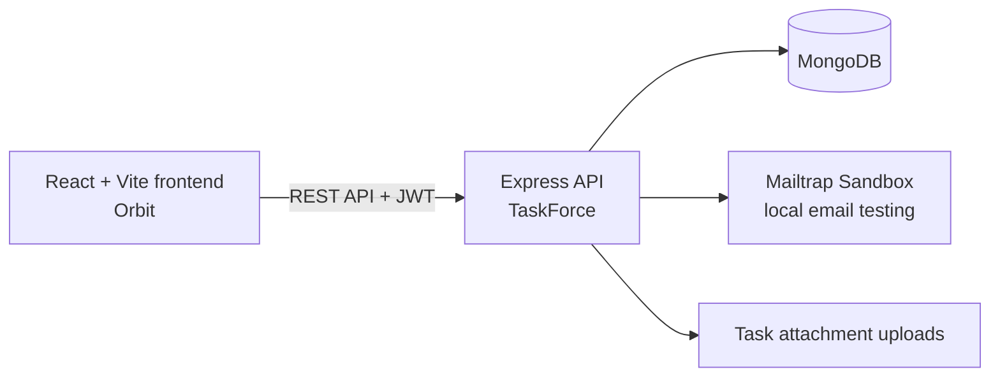

# Orbit

Orbit is the React frontend for TaskForce, a role-based project collaboration application. It is designed as a final-year placement project: the flows are practical, the code stays understandable, and the backend remains responsible for every permission decision.

## What it demonstrates

- Secure registration, email verification, login, password reset, refresh-token retry, and sign out.
- Three project roles: **Admin**, **Project Admin**, and **Member**.
- Projects, tasks, priorities, difficulty levels, due dates, subtasks, comments, notes, activity history, and notifications.
- A work-review flow: a member attaches evidence, submits work for review, and a manager approves or sends it back.
- Existing-user membership and unregistered-user invitation flows.

## Architecture



The UI hides controls that do not apply to a role, but the Express API is the final permission check. A user cannot gain manager access by changing frontend code.

## Run locally

Requirements: Node.js 20.19+ (Node.js 22 LTS recommended), MongoDB, and the TaskForce API running on port 3000.

```bash
npm install
cp .env.example .env
npm run dev
```

Open `http://localhost:5173`.

### Frontend environment

Set this value in `.env`:

```env
VITE_API_BASE_URL=http://localhost:3000/api/v1
```

Never commit `.env`. The backend configuration, Mailtrap credentials, MongoDB URI, and JWT secrets belong only in the backend `.env` file.

## Demo flow

Use this sequence during a placement demo:

1. Register an Admin account and verify it through the Mailtrap Sandbox inbox.
2. Create a project such as **Campus Placement Portal**.
3. Add a registered user as a Project Admin or invite a new user by email.
4. Create a task with an assignee, priority, difficulty, and due date.
5. As the member, open the task, add a comment/subtask, attach a small file, and submit it for review.
6. As the Admin or Project Admin, approve or return the work.
7. Open Notifications and Activity to show collaboration history.

Suggested harmless demo data:

| Item | Example |
| --- | --- |
| Project | Campus Placement Portal |
| Task | Build student profile screen |
| Priority / difficulty | High / Medium |
| Subtask | Add skill input validation |
| Comment | Profile API integration is ready for review. |

## Useful commands

```bash
npm run dev     # start local frontend
npm run build   # production build check
npm run lint    # static code-quality check
npm test        # small role/review unit tests
```

## Deployment notes

Build the frontend with `VITE_API_BASE_URL` set to the deployed backend URL. Deploy the Express API separately, then set its `CORS_ORIGIN`, password-reset URL, and invitation URL to the final HTTPS frontend origin. For real email delivery, replace the Mailtrap Sandbox setup with a verified sending domain and production SMTP/API credentials.

## Current verification

The backend automated suite validates core authentication, roles, tasks, due dates, comments, notifications, and activity history. The frontend has a small dependency-free test suite for role and review rules, plus build and lint checks. The final manual browser pass should use a separate demo account for each role before deployment.
